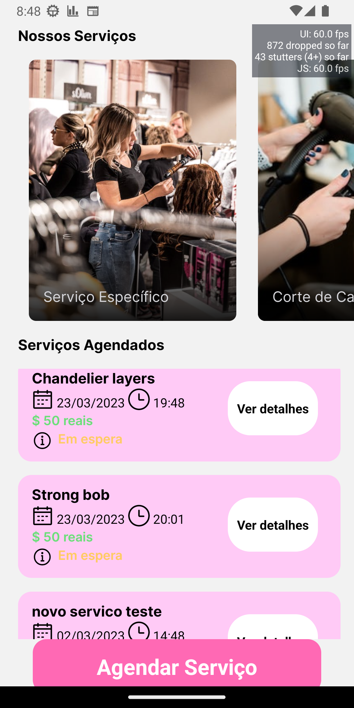
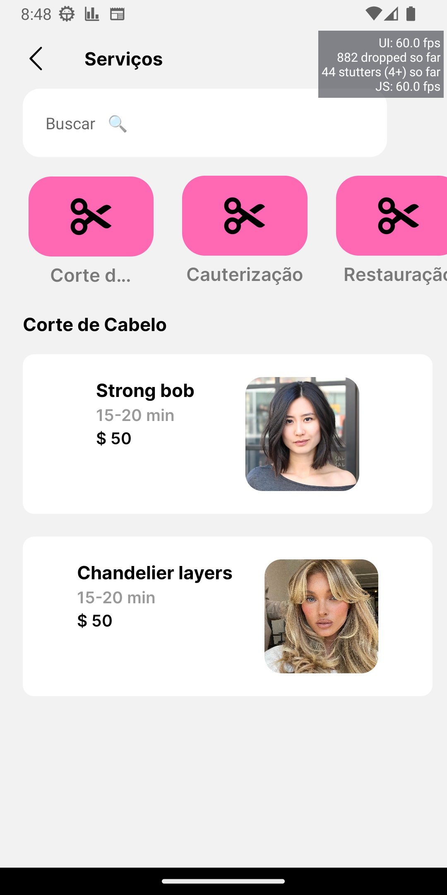
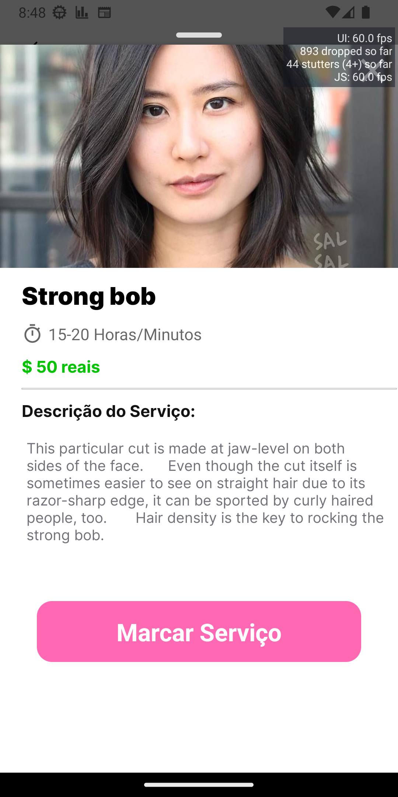
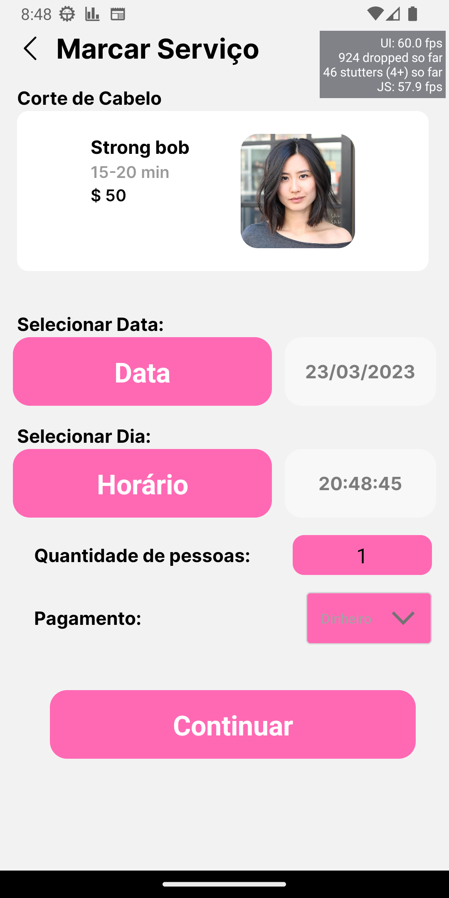

# App para agendamento de serviço em um salão (beta)

<div align="center">
	
  
  
  
</div>

## :dart: Objetivo

Criar um app para a parte cliente de um salão onde os usuários pudessem se agendar para serviços no salão.

## :hammer_and_wrench: Ferramentas

- [expo](https://expo.dev)
- [react native](https://reactnative.dev)
- [firebase](https://firebase.google.com/)
- [Arquitetura MVVM](https://learn.microsoft.com/pt-br/windows/uwp/data-binding/data-binding-and-mvvm)
- [typescript](https://www.typescriptlang.org/)

## :rocket: Executando o projeto

```bash
// Instale as dependências
npx expo install
// Concluindo a instalação rode
npx expo start
```
